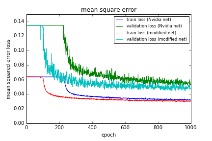

# Behavioral Cloning for Self Driving Car - Keras/Tensorflow

[](http://www.udacity.com/drive)

Keras/Tensorflow implementation of **End-to-End Learning for self driving car** with Udacity's self-driving car simulator. In this project, the convolution neural network(CNN) introduced by Nvidia[1] was used as a basis:

The goal of this project is to train the network to drive the road normally using steering through the image obtained from the driver's field of view.


*overview of this project*


Requirements and Downloads
---
### Environments
* [python 3.5.2](https://www.python.org/downloads/release/python-352/)
* [Tensorflow 1.0.0](https://www.tensorflow.org/)
* [Keras 1.2.2](https://keras.io/)

### Simulator
* [Udacity Self-Driving Car Simulator](https://github.com/udacity/self-driving-car-sim)

### Training data
Udacity offers sample training data for behavior cloning. and I also got data by driving car by using Udacity self-driving car simulator. The data contains images from left, front, right camera and corresponding steering angle. I used both of them in this project.

Click on the link below to download them.
* [Sample Training Data](https://d17h27t6h515a5.cloudfront.net/topher/2016/December/584f6edd_data/data.zip) (307MB)
* [Custom Training Data](https://www.dropbox.com/s/bkzju3xb59538jy/data_custom.zip?dl=0) (225MB)

Usage
---
### Train networks
You can see the whole code on [Behavior_Cloning.ipynb](./Behavior_Cloning.ipynb).

### Run simulator using trained network
Run the simulator and select autonomous mode. and then in terminal,

```
$ python drive.py model.h5
```
The above command will load the trained model and use the model to make predictions on individual images in real-time and send the predicted angle back to the server via a websocket connection. [[Details]](https://github.com/udacity/CarND-Behavioral-Cloning-P3)

### See code in detail
ipython code with description is available: [[link]](./Playground_02_reduce_params.ipynb)

Model Architectures
---
### 1. Nvidia Network
The number of **total parameters** of the network introduced by Nvidia is **`252,219`**. 

I added `Cropping` and `Resizing` layer to original network to match the input of the simulator. To reduce overfitting, `Dropout` layers were used after every `ReLU` layers with `0.5` probability to keep, and before every `Fully Connected` layers with `0.7` probability to keep.
The Nvidia network architecture is as follow:

| Layer | Output Shape | Param # | Stride |
|---|---:|---:|:---:|
| Input  | 160 x 320 x 3 | 0 | -  |
| Cropping  | 95 x 320 x 3 | 0 |-  |
| Resizing | 66 x 200 x 3  | 0 |-  |
| Normalization |  66 x 200 x 3 | 0 | -  |
| Convolution 5x5 | 31 x 98 x 24  | 1824 | (2,2) |
| ReLU | 31 x 98 x 24  | 0  |-  |
| Convolution 5x5 | 14 x 47 x 36  | 21636 | (2,2) |
|  ReLU  |  14 x 47 x 36 | 0  |-  |
| Convolution 5x5 | 5 x 22 x 48  | 43248 | (2,2) |
|  ReLU  | 5 x 22 x 48  | 0  |-  |
| Convolution 3x3 | 3 x 20 x 64 | 27712 |-  |
|  ReLU  | 3 x 20 x 64 | 0  |-  |
| Convolution 3x3 | 1 x 18 x 64 | 36928 |-  |
|  ReLU  | 1 x 18 x 64 | 0  |-  |
| Flatten  | 1 x 1 x 1152   | 0  |-  |
| Fully Connected | 1 x 1 x 100 |  115300  |-  |
| Fully Connected | 1 x 1 x 50 |  5050  |-  |
| Fully Connected | 1 x 1 x 10   |  510  |-  |
| Fully Connected | 1 x 1 x 1   |  11  |-  |

### 2. Modified Nvidia Network by using Spartial Factorization
The number of **total parameters** of the modified network is **`112,707`**. _The number of parameters of this network is below half of them of Nvidia's Network!_

Spartial factorization method which Christian Szegdy suggested was used[2]. Convolutions with filters larger than 3x3 can always be reduced into `a sequence of 3x3 convoluional layers` and even 3x3 convolutional layer can be factorized by using `3x1` and `1x3` convolutions. I applied this method to original Nvidia Network. the `Average Pooling` layer is added just before `first Fully Connected` layer. This architecture is inspired by `GoogleLeNet`[3]. `Dropout` layers were used in the same ways as original Nvidia Network. The modified network architecture is as follow:

| Layer | Output Shape | Param # | Stride |
|---|---:|---:|:---:|
| Input  | 160 x 320 x 3 | 0 | -  |
| Cropping  | 95 x 320 x 3 | 0 |-  |
| Resizing | 66 x 200 x 3  | 0 |-  |
| Convolution 5x5 | 31 x 98 x 24  | 1824 | (2,2) |
| ReLU | 31 x 98 x 24  | 0  |-  |
| Convolution 3x1 | 29 x 98 x 36 | 2628 |-  |
| Convolution 1x3 | 29 x 96 x 36 | 3924 |-  |
| Convolution 3x3 | 14 x 47 x 36 | 11700 | (2,2)  |
|  ReLU  | 14 x 47 x 36 | 0  |-  |
| Convolution 3x1 | 12 x 47 x 48 | 5232 |-  |
| Convolution 1x3 | 12 x 45 x 48 | 6960 |-  |
| Convolution 3x3 | 5 x 22 x 48 | 20784 | (2,2)  |
|  ReLU  | 5 x 22 x 48 | 0  |-  |
| Convolution 3x1 | 3 x 22 x 48 | 6960 |-  |
| Convolution 1x3 | 3 x 20 x 64 | 9280 |-  |
|  ReLU  | 3 x 20 x 64 | 0  |-  |
| Convolution 3x1 | 1 x 20 x 48 | 9264 |-  |
| Convolution 1x3 | 1 x 18 x 64 | 9280 |-  |
|  ReLU  | 1 x 18 x 64 | 0  |-  |
|  Average Pooling 1x6  | 1 x 3 x 64 | 0  |-  |
| Flatten  | 1 x 1 x 192   | 0  |-  |
| Fully Connected | 1 x 1 x 100 |   19300  |-  |
| Fully Connected | 1 x 1 x 50 |  5050  |-  |
| Fully Connected | 1 x 1 x 10   |  510  |-  |
| Fully Connected | 1 x 1 x 1   |  11  |-  |

Training Strategy
---
### Image Augmentation
To increase the number of data, I used two strategies.
1. Additionally using images from both left and right cameras.
2. Flipping images.

First, I assumed the corresponding steering angle of side cameras be `original steering angle +- 0.23`. The value of `0.23` was set empirically.

  


Second, I just flipped images to left and right. The required steering angle of it was simply assumed to be `the same value but opposite sign`.

  


### Optimizer settings
* Optimizer : Adam
* Loss: mse(mean squared error)
* Batch size : 1024
* Epoch: 1000 (~3 hours to train by using GTX1080)


Result
---
### 1. Training and Test MSE of Both Networks
The training results were impressive. Modified network works better than orignal one even though the total number of parameters is smaller. 
  

### 2. Self-driving Performance
Both Networks make car drive though the track without collision. In almost situations, the lane keeping performance of both networks is similar.


  


References
---
[1] [End to End Learning for Self-Driving Cars](https://arxiv.org/abs/1604.07316)

[2] [Rethinking the Inception Architecture for Computer Vision](https://arxiv.org/abs/1512.00567)

[3] [Going Deeper with Convolutions](https://arxiv.org/abs/1409.4842)
